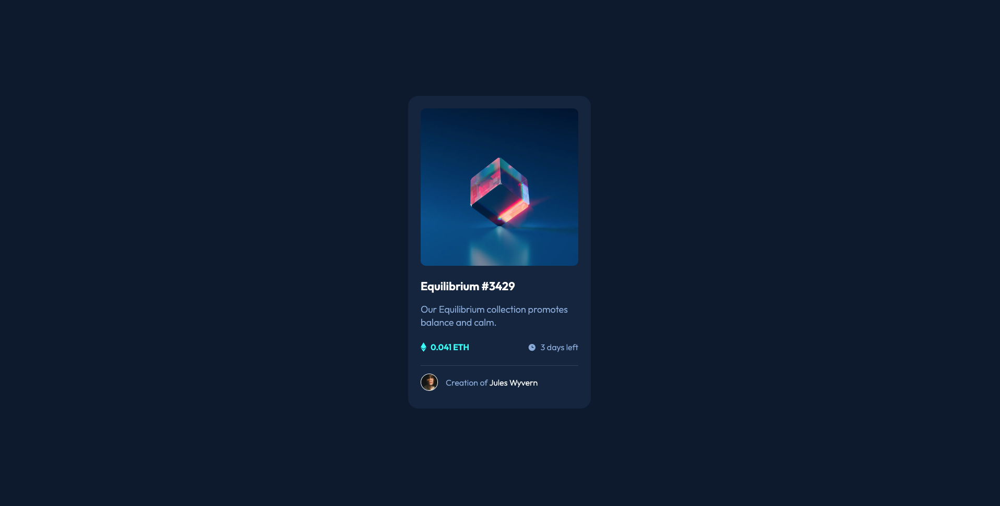

# Frontend Mentor - NFT preview card component solution

This is a solution to the [NFT preview card component challenge on Frontend Mentor](https://www.frontendmentor.io/challenges/nft-preview-card-component-SbdUL_w0U). Frontend Mentor challenges help you improve your coding skills by building realistic projects. 

## Table of contents

- [Overview](#overview)
  - [The challenge](#the-challenge)
  - [Screenshot](#screenshot)
  - [Links](#links)
- [Built with](#built-with)
- [Author](#author)

**Note: Delete this note and update the table of contents based on what sections you keep.**

## Overview

### The challenge

Users should be able to:

- View the optimal layout depending on their device's screen size
- See hover states for interactive elements

### Screenshot

### Links

- Solution URL: [Frontendmentor solution](https://www.frontendmentor.io/solutions/nft-card-using-scss-Hnee-0mIY)
- Live Site URL: [Live website](https://your-live-site-url.com)

## Built with

- HTML 5
- SCSS mixins and variables
- Flexbox

## Author

- Frontend Mentor - [@wikxn](https://www.frontendmentor.io/profile/wikxn)
